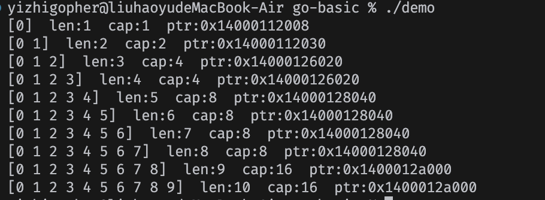

+++
title = 'Go basic'
date = 2024-11-08T15:24:06+08:00
draft = false
categories = ["golang之路"]
tags = ["golang", "study"]
pre = "/go-basic"
+++

上一章节我们已经简单介绍了一个最简单的go程序以及关于变量以及常量的定义。本章节将会继续极少go的基础知识。
## 基本运算符
go的基础运算符包含
- 数值计算：加`+`，减`-`，乘`*`，除`/`，求余`%`
- 逻辑计算：与`&&`，或`||`，非`!`
- 位运算符号：`&`，`|`，`^`，`>>`，`<<`
- 关系运算符：相等`==`，不等于`!=`，大于`>`，大于等于`>=`，小于`<`，小于等于`<=`
## 流程控制
### if-else分支结构
`if-else`分支判断结构如下所示：
```go
if 判断1 {
    语句1
} else if 判断2{
    语句2
} else {
    语句3
}
```
需要注意的是：
1. 花括号不能换行，必须和if在同一行内
2. 花括号是不可以省略的，即使语句1中只有1个语句

在go中`if-else`还有一种特殊且常用的写法：
```go
func ifDemo() {
	if score := 65; score >= 90 {
		fmt.Println("A")
	} else if score > 75 {
		fmt.Println("B")
	} else {
		fmt.Println("C")
	}
}
```
我们可以在`if`表达式之前添加一个执行语句，再根据变量值进行判断，并且这个变量的作用域仅在这段`if-else`语句中。
### 循环结构
go中所有的循环均适用`for`来实现，不会有`while`以及`do-until`结构。

`for`循环的基本结构如下
```go
for 初始语句;终止语句;每步更新内容 {
    ...
}
```
其中初始语句、终止语句以及每步更新内容都不是必填项。
例如:
```go
for i := 0; i< 10; i++ {
    print(i)
}
// -----------------------
i := 0
for i < 10 {
    print(i)
    i++
}
// -----------------------
i := 0
for {
    if i >= 10 {
        break
    }
    print(i)
    i += 1
}
```
以上三种写法均是等价的。


此外还有`for-range`遍历结构：
```go
for k,v := range variable {
    
}
```
其中`variable`可以是`map`,`string`,`slice`,`array`等类型，`k`表示索引，`v`表示索引对应的值。

在`go1.22`版本中对循环结构增加了几个特性。

首先是增加了对整数range的新特性，上述代码也可以这么写：
```go
for i := range 10 {
    print(i)
}
```
此外去除了`for-range`不在共享循环变量，在`go1.16`和`go1.22`两个版本中分别运行一下代码，执行结果会有所不同。
```go
list := []int{1, 2, 3, 4, 5}
for _, val := range list {
    go func() {
        print(val)
    }()
}
```
旧版本中`for`循环迭代器的变量是一个单一变量，在每个循环迭代中仅是取值不同。这样做在性能上非常高效，但如果使用不当，会导致意想不到的行为，可能会造成共享循环变量的问题。而`go1.22`中，`for`循环的每次迭代都会创建新变量，每次循环自己迭代自己的变量，以避免意外共享错误。关于这方面的知识可以阅读这篇[博客](https://zhuanlan.zhihu.com/p/676822973)。
## 数组与切片
### 数组(Array)
数组是同一种数据类型元素的集合。在Go语言中，数组从声明时就确定，使用时可以修改数组成员，但是数组大小**不可变化**。示例如下：
```go
var a [3]int // {0, 0, 0}
var cities [3]string{"Shanghai", "Beijing"} // {"Shanghai", "Beijing", ""}
var deduce [...]int{1, 2, 3} // 数组大小就是3了
var matrix [2][3]int{
    {1, 2, 3},
    {4, 5, 6},
}
```
可以通过如下方式实现数组的遍历：
```go
for i := 0; i < len(cities); i++ {
    print(cities[i])
}
for _, val := range cities {
    print(val)
}
```
需要注意的是，如果在函数中传入一个数组类型的变量，那么仅会copy值到另一个变量中，而不是传递一个引用。
```go
func modifyArray(x [3]int) {
	x[0] = 100
}

func modifyArray2(x [3][2]int) {
	x[2][0] = 100
}
func main() {
	a := [3]int{10, 20, 30}
	modifyArray(a) //在modify中修改的是a的副本x
	fmt.Println(a) //[10 20 30]
	b := [3][2]int{
		{1, 1},
		{1, 1},
		{1, 1},
	}
	modifyArray2(b) //在modify中修改的是b的副本x
	fmt.Println(b)  //[[1 1] [1 1] [1 1]]
}
```
> [n]*T表示指针数组，*[n]T表示数组指针 。
### 切片(Array)
由于数组长度**不可变**，我们也希望go中能有个像`vector`的类型，能够支持可变长度。

切片（Slice）是一个拥有相同类型元素的可变长度的序列。它是基于数组类型做的一层封装。它非常灵活，支持自动扩容。

切片是一个**引用类型**，它的内部结构包含地址、长度和容量。切片一般用于快速地操作一块数据集合。申明切片变量如下：
```go
var x []T
var a []int{1, 2, 3}
var slice = make([]int, 3, 10) // 定义了len==3，cap==10的切片
```
> make函数仅用来初始化`slice`, `map`以及`chan`三种类型的变量

切片拥有自己的长度和容量，我们可以通过使用内置的`len()`函数求长度，使用内置的`cap()`函数求切片的容量。

我们也可以在数组上，创建一个切片
```go
var x [5]int{1, 2, 3, 4, 5}
b := x[3:5] // 左闭右开。
```
切片的本质就是对底层数组的封装，它包含了三个信息：底层数组的指针、切片的长度（len）和切片的容量（cap）。因此判断切片是否为空，应当如下：
```go
if len(s) == 0 {

}
```
而不是`s==nil`，如果这么比较的话，实际上是在判断指针是否为空。例如：
```go
var s1 []int         //len(s1)=0;cap(s1)=0;s1==nil
s2 := []int{}        //len(s2)=0;cap(s2)=0;s2!=nil
s3 := make([]int, 0) //len(s3)=0;cap(s3)=0;s3!=nil
```
由由于切片是指向**底层数据**的指针，因此如果copy，那么对copy后的变量进行修改，原先的变量也会发生改变，举个例子：
```go
package main

import "fmt"

func sliceFunc(s []int, val int)  {
	s[0] = val
}

func main() {
	var list = [5]int{1, 2, 3, 4, 5}
	s1 := list[0:3]
	s2 := list[:]
	s3 := s2
	sliceFunc(s1, 6)
	fmt.Println(list) //[6 2 3 4 5]
	for _, val := range	s1 {
		print(val, " ")
	}
	println() //6 2 3 
	for _, val := range	s2 {
		print(val, " ")
	}
	println() // 6 2 3 4 5 
	for _, val := range	s3 {
		print(val, " ")
	}
	println() // 6 2 3 4 5
}
```
因此，当我们使用切片时，最好遵循**所有权的唯一性**原则（这在Rust中被纳入语法范围中），即对于内存中的某个数据，同一时刻一个值只能有一个所有者。

既然切片的长度是可变的，那么该如何增加切片的元素呢：
```go
func main() {
	//append()添加元素和切片扩容
	var numSlice []int
	for i := 0; i < 10; i++ {
		numSlice = append(numSlice, i)
		fmt.Printf("%v  len:%d  cap:%d  ptr:%p\n", numSlice, len(numSlice), cap(numSlice), numSlice)
	}
}
```


使用内置的append函数即可。
>需要注意的是，每个切片会指向一个底层数组，这个数组的容量够用就添加新增元素。当底层数组不能容纳新增的元素时，切片就会自动按照一定的策略进行“扩容”，此时该切片指向的底层数组就会**更换**。“扩容”操作往往发生在append()函数调用时，所以我们通常都需要用原变量接收append函数的返回值。

关于每次扩容对`cap`修改的策略，可以参考`${GOROOT}/src/runtime/slice.go`的源码，这里就不过多展开。
## 字典(map)
map是一种无序的基于key-value的数据结构，Go语言中的map是引用类型，必须初始化才能使用。
```go
var stuMap map[string]int
stuMap = make(map[string]int)
stuMap["Tom"] = 24
exampleMap := map[string]string{
    "code": "23",
    "message": "Query success!",
}
```
>思考下`[]map[string]int`和`map[string][]int`之间的区别

如何判断某个键是否存在：
```go
_, ok := m[key]
if !ok{
    println("key is not existed!")
}
```
可以通过如下方法删去map中的某个键：
```go
delete(m, key)
```
## 思考
```go
package main

import "fmt"

func main() {
	type Map map[string][]int
	m := make(Map)
	s := []int{1, 2}
	s = append(s, 3)
	fmt.Printf("%+v\n", s)
	m["q1mi"] = s
	s = append(s[:1], s[2:]...)
	fmt.Printf("%+v\n", s)
	fmt.Printf("%+v\n", m["q1mi"])
}
```
尝试写出上面这段代码的结果，从而深刻理解本章节所阐述的内容。
<!-- ## 结构体与接口

## 函数与方法  -->
