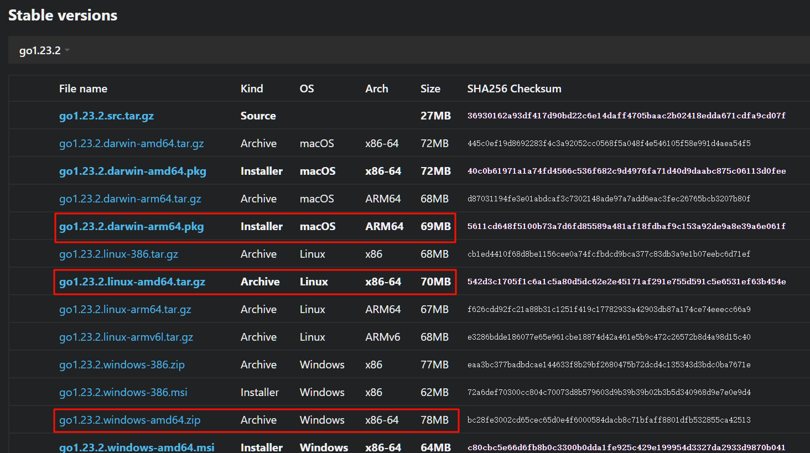
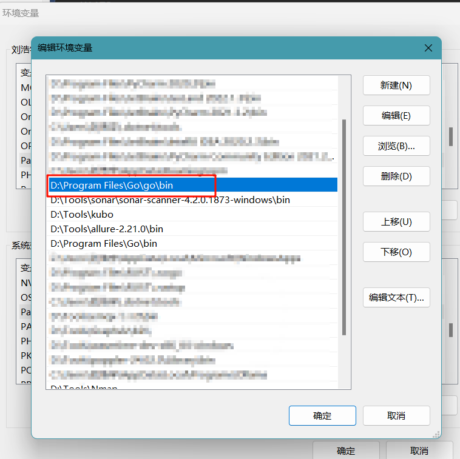
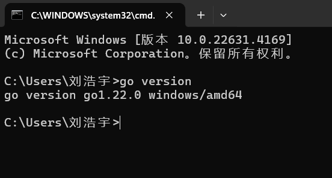
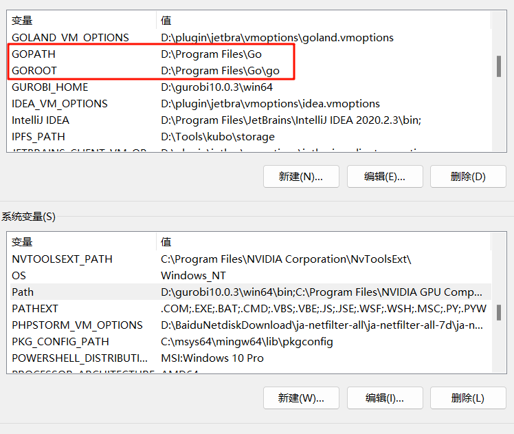

+++
title = 'Go语言环境安装'
date = 2024-10-08T15:47:15+08:00
draft = false
categories=['golang之路']
tags=['golang', 'study']
+++

在本节中，我们将首先简单介绍下如何安装Go语言环境，以开启Go语言学习之路！我们将简单介绍在Windows环境，Linux环境以及Mac环境下如何安装，尽可能全面的覆盖不同读者所使用的操作系统。

Go语言[下载地址](https://golang.google.cn/dl/)



# Windows安装

下载windows环境下的zip文件，解压到系统的某个目录中，在我的系统中，我将其解压到本地D盘目录`D:\Program Files\Go\go`下。

之后在系统的环境变量中将该目录下的`bin`目录添加到环境变量中，如图所示：



保存后通过打开终端，输入`go version`即可判断是否添加到环境变量中



之后需申明`GOROOT`、`GOPATH`，并将`GOPATH`目录下的`bin`目录添加到环境变量中，便于后续调用`go install`指令安装的命令。



# Linux安装

下载图1中的源码包，删除 /usr/local/go 文件夹（如果存在），删除之前安装的 Go，然后将刚刚下载的压缩包解压缩到/usr/local，在 /usr/local/go 中创建一个全新的 `GOROOT`

```shell
 rm -rf /usr/local/go && tar -C /usr/local -xzf go1.23.2.linux-amd64.tar.gz
```

在PATH环境变量中添加/usr/local/go/bin，在$HOME/.profile或/etc/profile（用于全系统安装）中添加以下一行即可：

```shell
export GOROOT=/usr/local/go
export GOPATH=/data/go
export PATH=$GOPATH/bin:$GOROOT/bin:$PATH
```

之后使用命令`source $HOME/.profile`激活环境变量配置即可。

# Mac安装

安装图1中的`.pkg`安装文件即可

执行以下命令：

```bash
cd ~
vim .bash_profile
```

编辑用户环境变量：

```shell
export GOPATH=/Users/XXX/go #本地创建的gopath绝对路径
export PATH=$PATH:$GOPATH/bin
```

激活配置文件`source ~/.bash_profile`即可。

# 额外的注意点：

需要注意的是，`GOPATH`目录下需要创建三个文件夹，分别是`src`、`pkg`以及`bin`，其中`bin`目录保存`go install`安装的指令，`pkg`保存第三方包的源码，`src`用于在`GO111MODULE=off`时，在该路径下编写包含第三方包的程序（现在基本不在`src`下写代码了）

之后我们需要覆写go的几个配置：

```shell
go env -w GO111MODULE=on
go env -w GOPROXY=https://goproxy.cn,direct
```

`GO111MODULE`是Go语言用于管理依赖关系的一种机制，它可以帮助开发者更好地管理项目的依赖包，并且可以确保项目在不同环境下的一致性

`GOPROXY`表示Go安装第三方包的代理（因为国内众所周知的原因），便于后续直接`go get`安装第三方包

至此，go的安装已经完成了
