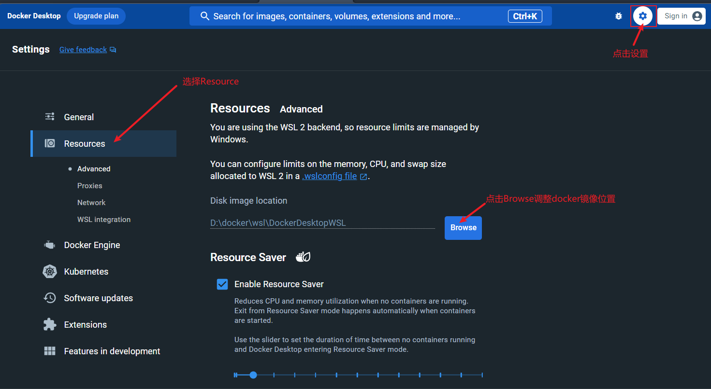

# docker介绍以及安装步骤说明


### 什么是docker

docker可以说是一门技术、一种软件，它能够帮助我们将程序进行打包，从而方便后续的项目部署以及维护。

### 为什么要用docker

> 场景：做项目开发的同学经常会遇到一个问题，就是这个项目能够在本地上运行，但是换一台电脑却会报各种各样的错误，这个时候不得不面对环境配置这一极其麻烦的问题

所以我们说，docker将过去的程序和系统环境的绑定关系给打破了，只要我们的电脑安装了docker，我就可以通过拉取云端的镜像，无需关注环境的搭建就可以实现跨平台的应用部署。我们不再需要面对繁杂的应用上云出现的环境搭建问题，就可以轻松地使用服务。

### 怎样安装docker

安装docker：

- Windows系统：
  
  在Windows系统，我们需要确保自己的电脑安装了WSL
  
  以管理员身份打开CMD，并敲入：
  
  ```cmd
  wsl --install
  ```
  
  官方文档：[安装 WSL | Microsoft Learn](https://learn.microsoft.com/zh-cn/windows/wsl/install)，可查阅官方文档获得更多的信息。
  
  之后我们前往docker-desktop官方网站[Docker Desktop: The #1 Containerization Tool for Developers | Docker](https://www.docker.com/products/docker-desktop/)下载最新的docker-desktop即可。
  
  需要注意的是，在使用安装好的docker-desktop之前，我们需要修改几个配置
  
  - 调整docker虚拟机的位置，不然根据初始设置，会把C盘占满
    
    
  
  - 修改docker的镜像源信息，不然在docker pull拉取镜像时，会特别慢：
    
    
    
    将其中的内容替换成下述信息：
    
    ```json
    {
      "builder": {
        "gc": {
          "defaultKeepStorage": "20GB",
          "enabled": true
        }
      },
      "experimental": false,
      "features": {
        "buildkit": true
      },
      "registry-mirrors": [
        "http://hub-mirror.c.163.com",
        "https://mirror.ccs.tencentyun.com"
      ]
    }
    ```
    
    或者直接修改`C:\Users\{{ USERNAME }}\.docker\daemon.json`内容为上述信息，重启docker。
  
  - 判断是否安装成功，在CMD中，敲入：
    
    ```cmd
    docker version
    ```
    
    出现如下信息即可：
    
    
  
  > docker之所以需要在Linux环境下使用，是源于在使用go进行编写docker时，需要借助Linux系统的Namespace和Cgroup隔离机制，所以我们在Windows上运行docker实质上是在Windows上安装了一个虚拟机WSL，在虚拟机的内部执行docker

- Ubuntu系统：
  
  - 更新索引：`sudo apt-get update`
  
  - 安装：`sudo apt install docker.io`
  
  - 修改镜像源：在`/etc/docker`目录下创建`daemon.json`，在里面添加：
    
    ```json
    {
        "registry-mirrors": [
            "http://hub-mirror.c.163.com",
            "https://mirror.ccs.tencentyun.com"
         ]
    }
    ```
    
    即可
  
  - 判断是否安装成功，在终端输入：`docker --version`，出现
    
    
    
    即可

- CentOS/aliyun服务器：
  
  - 卸载旧版（如果你之前没有安装过，可跳过这一步）
    
    ```sh
    yum remove docker \
                      docker-client \
                      docker-client-latest \
                      docker-common \
                      docker-latest \
                      docker-latest-logrotate \
                      docker-logrotate \
                      docker-engine
    ```

- 安装依赖包：`yum install -y yum-utils`

- 为了防止是从国外的源下载，所以配置阿里云地址：`yum-config-manager --add-repo http://mirrors.aliyun.com/docker-ce/linux/centos/docker-ce.repo`

- 更新依赖：`yum update`

- 安装docker：`yum install docker-ce docker-ce-cli containerd.io`

- 配置docker镜像源：同样的在`/etc/docker`目录下创建`daemon.json`文件，填入镜像源地址信息即可。

- 启动docker服务：`systemctl start docker`

- 判断是否安装完成：控制台输入`docker info`，看到镜像源信息更改即为安装成功
  
  
  
  > 当然你可以也可以在其他平台上使用docker info来判断镜像源的地址信息是否成功修改

### 一些最基本的概念

- 仓库Registry：你可以理解为类似代码仓库的东西，只是这里面存放的不是一段段代码，而是一堆镜像，我们可以通过一些指令来获得或上传镜像信息。
- 镜像Image：它是一种模板，具有创建docker容器的指令。并且一种镜像是得基于另一种镜像才能构建。我们可以把这个理解为虚拟机安装所需的iso文件，只要我有这个iso文件，我就可以打造多个一样的虚拟机环境。当然我们还可以在这个iso的基础上附带一些东西，构成一个新的iso。例如centos分为minimal（最基础的）以及desktop（带有桌面UI的），desktop就是基于minimal，同时又添加了新的东西形成的新的iso文件。
- 容器Container：它是一种运行实例，每个容器之间是相互隔离互不影响的。同样的，我们举个例子，当你拥有一个iso文件时，你不把它放在VMware中产生一个虚拟机实例，那么这个iso文件也就毫无用处。而你使用同一个iso文件创建的不同虚拟机之间也是不会有任何影响，你不会发现，在A虚拟机中创建了一个文件，B虚拟机中也可以找到。

如果上述的例子还是不能让你理解这三者之间的关系和实际的作用，我们可以拿日常开发做一个例子。仓库Registry就是github.com；镜像就是github.com中的pytorch项目代码，我们可以利用pytorch本身的东西创建一个新的例如predict的项目代码，当然我们也可以上传到github；容器就相当于我们执行这段代码的进程，每个进程之间不会相互影响（不考虑使用共享内存，管道等方式实现进程间的控制）。

### 总结

在这一章中，我们大概介绍了docker的一些基本信息和安装方式，在下一章我们会在ubuntu系统上介绍docker的基本操作。


